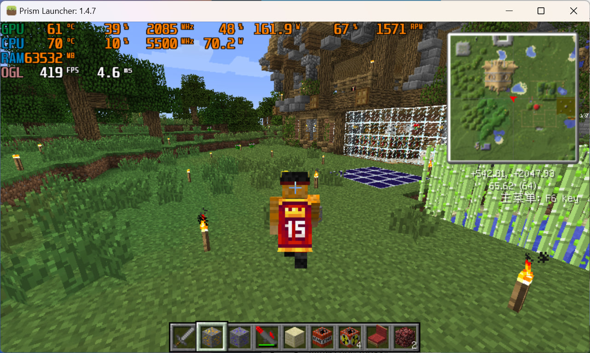

# The Story of SkinMeAgain

### **我是如何拯救消逝的 Minecraft 皮肤的**

源于一次怀旧的冲动，某天，我突然想重温老版本的 Minecraft——早期的版本，总是能带来不一样的感觉，那是更简单、更空荡的时光。

我维护着一个 Minecraft 1.4.7 的服务器，它已经默默运行了很多年——它的整合包可以追溯到 2012 年，内置了当年的 **SkinMe mod**。

我几乎把它给忘了，但老版本总是高效而可靠。纵使多数玩家已经离开了，我还是一直留着它。

有时候，我也会回来看看，只为怀旧一番。

&nbsp;

当我加入服务器时，看到的是——我的角色，一个千篇一律又面无表情的史蒂夫。

它不会再显示出任何皮肤了，我一直都知道。

SkinMe 已经停运了很长时间，而 Mojang 针对旧版本的皮肤 API 在许多年前也已经失效了。

但是，当我瞥了一眼游戏日志时，我发现 SkinMe mod 还在尝试连接一些不存在的域名。

这不对。

我记得以前人们并没有提过什么回落服务器，但此刻我觉得其中有什么东西还没被发现。

&nbsp;

我开始深入挖掘。

我反编译了 SkinMe mod，找到了一个（可能是）**隐藏的回落服务器列表**，硬编码在代码中。

这些服务器原本是为了当 SkinMe 和 Mojang 服务器下线时，从其他人的平台获取数据，以保持皮肤显示。

但当我查看这些域名时，发现其中有两个已经过期了。

这个系统之所以失效，不是因为设计不合理，而是因为它早已被人忘却。

我看到的是一件遗失的数字文物。

&nbsp;

我意识到：**我可以拯救它们。**

&nbsp;

我注册了这两个域名，带着幸运和激动，我开始重新让它们上线。

我写下了你现在看到的代码，从 [CustomSkinLoader](https://modrinth.com/mod/customskinloader) 扒来了现在的回落服务器顺序（Mojang -> LittleSkin -> Blessing Skin -> ElyBy -> TLauncher），把请求指向它们应该去的地方。

一切已准备就绪，我们即将走向过去。

&nbsp;

从 2024-12-03 或 2024-12-04（取决于你在哪）开始，全世界的 Minecraft 1.3.x 到 1.7.x（切换到 UUID 以前的版本）玩家，只要还装有 SkinMe mod，都能发现皮肤突然重新出现了。

这些曾经被时间遗忘的方块人形象会再次亮起，在那些已经习惯了只看到 Steve 的服务器上闪耀。这不仅仅是一个技术上的项目，还是为了**找回历史**——让那些像素的记忆不再被遗忘。

&nbsp;

对我来说，这就是**保护旧互联网**的意义所在。

不仅仅是数据，还有一起玩游戏的时光，那些数字头像背后的人们。

**SkinMeAgain** 不仅是一次再现，它也是对过去那些冒险的致敬，还是一种承诺——即使这个世界日新月异，我们也不会忘记我们从哪里来。

_So go on, fire up your beloved old Minecraft versions, and see your skin light up again._



## 运行

需要 Deno。

```sh
deno run --allow-net skinmeagain.js
```

## 许可证

MIT License
